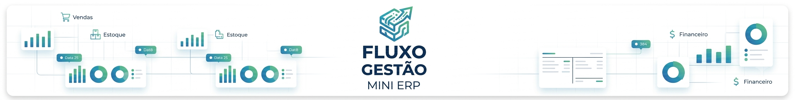
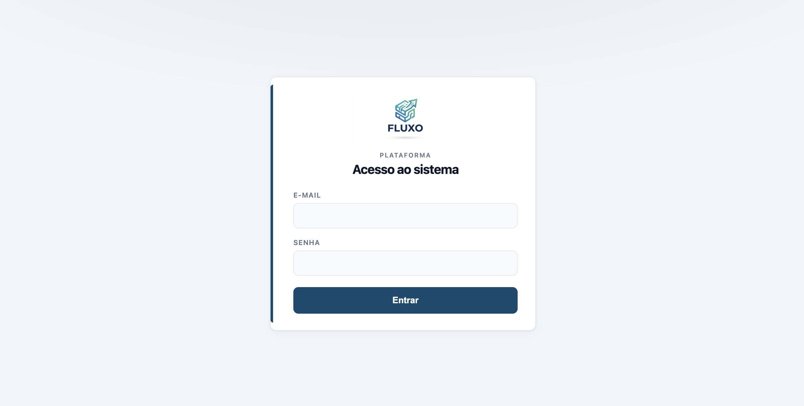
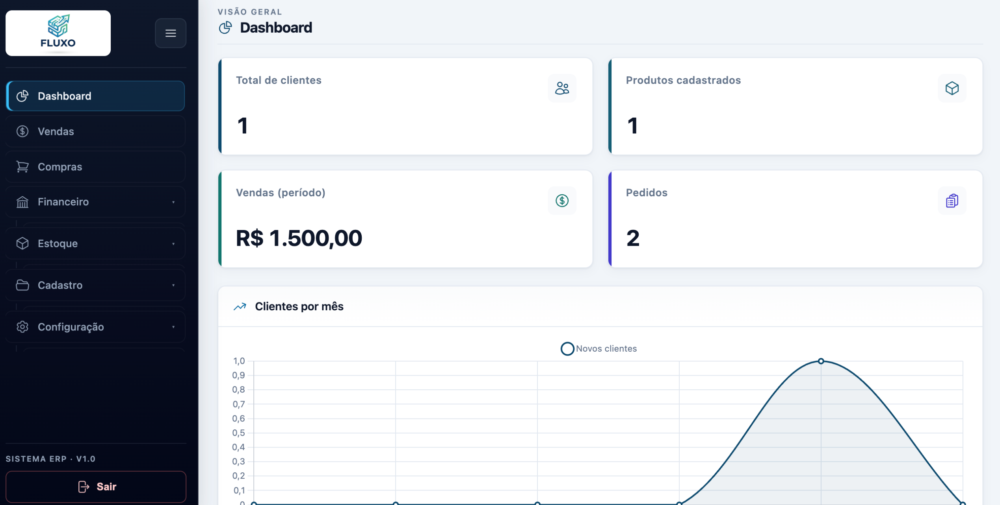
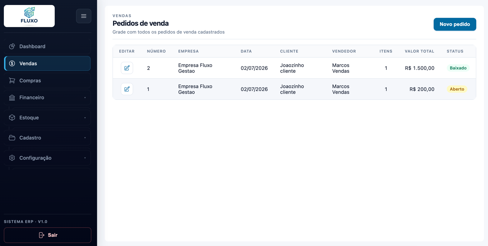
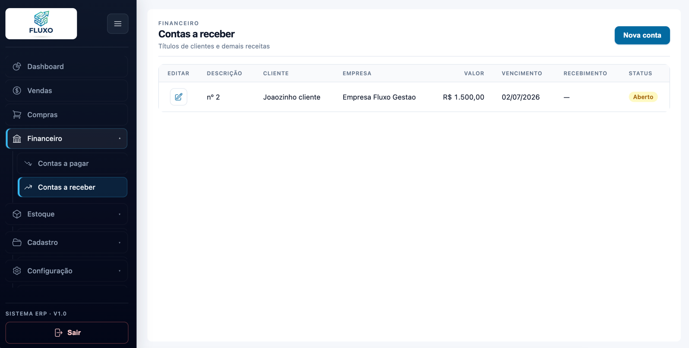
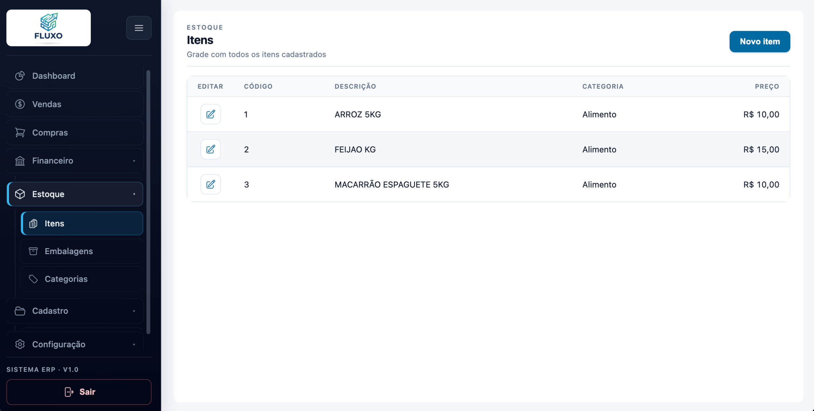
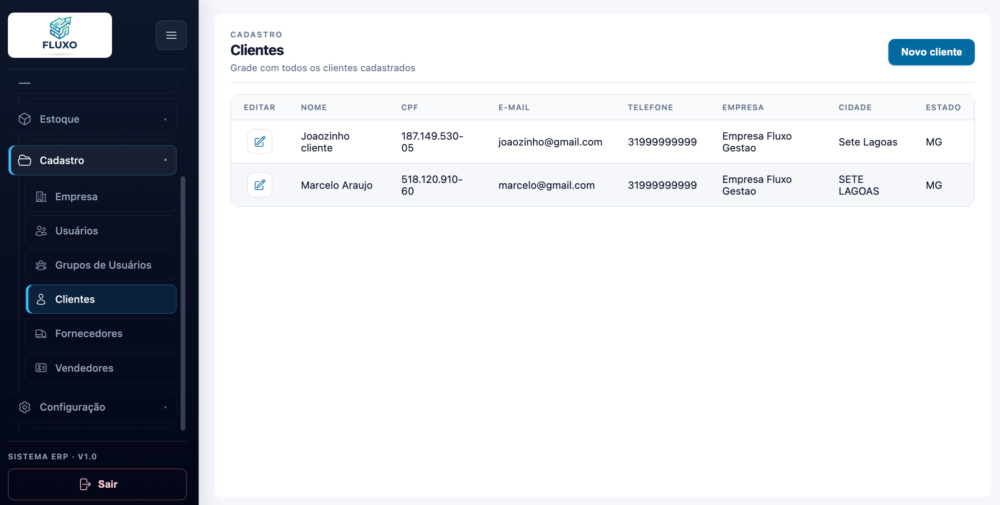

# Fluxo Gestão - Mini ERP

<!-- Banner principal: docs/screenshots/banner.png -->


Este é um projeto de um Mini ERP (Enterprise Resource Planning) desenvolvido para fins educacionais. O objetivo deste projeto é fornecer uma solução simples e eficiente para a gestão de recursos empresariais, incluindo controle de estoque, vendas, compras e finanças.

## Capturas de tela

### Acesso e navegação



### Dashboard Inicial



### Vendas e compras



### Financeiro



### Estoque



### Cadastro



## Funcionalidades
- **Controle de Estoque**: Permite gerenciar o estoque de produtos, incluindo entradas, saídas e níveis de estoque.
- **Gestão de Vendas**: Facilita o processo de vendas, desde a criação de pedidos até a emissão de notas fiscais.
- **Gestão de Compras**: Permite o controle de compras, incluindo fornecedores, pedidos de compra e recebimento de mercadorias.
- **Gestão Financeira**: Oferece ferramentas para controle financeiro, como fluxo de caixa, contas a pagar e contas a receber.
- **Relatórios**: Gera relatórios detalhados sobre vendas, estoque, finanças e outros aspectos do negócio.

## Tecnologias Utilizadas
- **Backend**: Laravel (PHP)
- **Frontend**: Blade (Laravel Templating Engine)
- **Banco de Dados**: PostgreSQL
- **Autenticação**: Laravel Sanctum
- **Hospedagem**: Heroku (opcional)

## Instalação

### Pré-requisitos

Antes de começar, instale e configure:

- **PHP** `>= 8.1` com as extensões: `pdo_pgsql`, `mbstring`, `openssl`, `tokenizer`, `xml`, `ctype`, `json`, `bcmath`, `fileinfo`
- **Composer** (gerenciador de dependências PHP)
- **Node.js** `>= 18` e **npm** (compilação dos assets com Vite)
- **PostgreSQL** `>= 13`
- **Git**

Opcionalmente, você pode usar o [Laravel Herd](https://herd.laravel.com/) no macOS/Windows para servir o projeto automaticamente a partir da pasta `Herd`.

### Passo a passo

1. Clone o repositório:

```bash
git clone https://github.com/WalissonMariano/mini-erp.git
cd mini-erp
```

2. Instale as dependências do PHP:

```bash
composer install
```

3. Crie o arquivo de ambiente e gere a chave da aplicação:

```bash
cp .env.example .env
php artisan key:generate
```

4. Crie o banco de dados no PostgreSQL (exemplo):

```sql
CREATE DATABASE erp;
```

5. Configure o `.env` com os dados do banco e da aplicação:

```env
APP_NAME="Fluxo Gestão"
APP_URL=http://mini-erp.test

DB_CONNECTION=pgsql
DB_HOST=127.0.0.1
DB_PORT=5432
DB_DATABASE=erp
DB_USERNAME=seu_usuario
DB_PASSWORD=sua_senha
```

> Se estiver usando `php artisan serve`, use `APP_URL=http://127.0.0.1:8000`.  
> Se estiver usando Laravel Herd, use o domínio gerado pelo Herd (ex.: `http://mini-erp.test`).

6. Execute as migrations (cria as tabelas e o usuário administrador padrão):

```bash
php artisan migrate
```

7. Instale as dependências do frontend e compile os assets:

```bash
npm install
npm run dev
```

> Em produção, use `npm run build` em vez de `npm run dev`.

8. Inicie o servidor (se não estiver usando Laravel Herd):

```bash
php artisan serve
```

9. Acesse a aplicação:

- Com Herd: `http://mini-erp.test`
- Com `artisan serve`: `http://127.0.0.1:8000`

### Usuário padrão

Após rodar as migrations, o sistema cria automaticamente um usuário administrador:

| Campo  | Valor              |
|--------|--------------------|
| E-mail | `admin@admin.com`  |
| Senha  | `123456`           |

### Comandos úteis

```bash
# Limpar cache de configuração
php artisan config:clear

# Recriar o banco do zero (apaga todos os dados)
php artisan migrate:fresh

# Rodar testes
php artisan test
```

